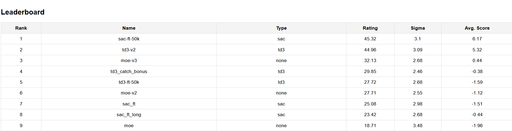

# Reinforce the Puck [](https://github.com/Super-T02/Reinforce-the-Puck/actions/workflows/build-pdf.yml) [](https://github.com/Super-T02/Reinforce-the-Puck/actions/workflows/python-app.yml)

This repository implements agents for the [Hockey-Environment](https://github.com/martius-lab/hockey-env) of the Reinforcement Learning Lecture at the University of Tübingen in the Winter Term 24/25.

![[example.gif]]

## Installation

The following section describes how to install all dependencies for the project.

### Prerequisites

- Python 3.12
- Poetry

To install Poetry, follow the instructions [here](https://python-poetry.org/docs/#installation).

### Install Dependencies

Ensure you have Python 3.12 and Poetry installed. Then, run the following commands to install the dependencies:

```bash
poetry install
```

Additionally, install the requirements from `requirements.txt`:

```bash
pip install -r requirements.txt
```

## File Structure

The framework contains multiple folders, to provide a high abstraction and easy to implement interface for multiple agents and environments:

```py
| - .github/ # Actions for our github repo, like building the report and run tests
| - .vscode/ # Editor Config
| - config/ # Contains Configurations for training and tournaments
    | - config.yaml # Basic config
    | - ...
    | - tournament.yaml # The tournament configuration file
| - experiments/ # Contains notebooks where some features are tested
    | - buffers.ipynb # Tested buffer behavior
    | - Hockey-Env.ipynb # Test around with the hockey environment
    | - small_eval.ipynb # Evaluation on the basic environments
    | - sumtree.ipynb # Test sum tree implementation and behavior
    | - tournament.ipynb # Test how tournaments work
| - final_checkpoints/ # Contains our final and best checkpoints
| - gifs/ # Contains gifs generated with rendered_run.py
| - logs/ # Contains Tensorboard logs
| - models/ # Contains .gitignored checkpoints
| - reinforce-the-puck/ # Source folder
    | - agents/
        | - ...
        | - agent_factory.py # Generates agents by config or checkpoint
        | - base_agent.py # Interface for all agents
        | - base_trainer.py # Training loop interface
        | - basic_hockey_opponent.py #  Baisc Opponent provided for the Hockey env
        | - ddpg.py # DDPG implementation
        | - double_q_net.py # DDQN Implementation
        | - moe_agent.py # Multi Agent implementation
        | - sac_hierarchical.py # Hierarchical SAC
        | - sac.py # Original SAC implementation
        | - td3_cross.py # Cross Q on TD3
        | - td3.py # Original TD3 implementation
    | - components/ # Includes important components
        | - data_structures.py # Sum Tree  implementation
        | - memory.py # Replay Buffers
        | - networks.py # NN Networks like Q-Nets
        | - noise.py # Gaussian, ClippedGaussian and ClippedColoredNoise
    | - environments/
        | - advanced_reward_calculator.py # New rewards
        | - base_wrapper.py # Interface for gymnasium environments
        | - environment_factory.py # Generates environments based on  the config
        | - hockey_wrapper.py # Wrapper for the Hockey environment
    | - evaluation/ # Contains logic for tensorboard
    | - templates/ # Contains the leaderboard html template
    | - utils/
        | - __init__.py # Defines workspace and other important paths
        | - checkpoint.py # Implements the checkpoint management for the training class
        | - config.py # Handles configuration and parses the input yaml
        | - logger.py # Load and setup our logging configuration
    | - __init__.py # Initialized on load
    | - comprl_hockey.py # Connect to competition server
    | - final_evaluation.py # Get the avg. win rates against the baseline opponents
    | - logging_cli.py # Cli to interact with the logging folder
    | - render_run.py # Render a checkpoint and show the results
    | - tournament.py # Run a tournament with the specified config and hosts the leaderboard
    | - train.py # Start the training
| - tests/ # Contains important tests
| - .gitignore
| - .pre-commit-config.yaml
| - autorestart.sh # Script to restart agent, when connection to competition is lost
| - LICENSE # MIT License
| - pyproject.toml # Dependencies managed via poetry
| - README.md # This file
| - report.pdf # Our final report
| - requirements.txt # Dependencies not managed via poetry
| - run_training.sh # Shell script to distribute training of multiple agents on multiple processes.
| - task.pdf # Provided goal of the project
```

## Run Training

We provide to possibilities to train the agents:

1. Run `python reinforce-the-puck/train.py -c <config-file-path>`: Will start a sequential training of the specified configuration. Thus, agent2 starts after agent1 finishes.
2. Run `./run_training.sh <config-file-path> <max-num-of-processes>`: Will start distributed training of one process  for each agent to train. Thus, agent2 and agent1 are trained in parallel. (Ensure for this method, that yq is installed and working. If you face issues, use variant 1).

## Run Rendered Run

You can run a rendered run with:

```sh
python reinforce-the-puck/render_run.py --env <Envornment> --episodes <N-Episodes> --agent_type <Agent Type> --agent <path-to-pth-file> --opponent-type <opponent-type> --opponent-checkpoint <path-to-opponent-pth-file>
```

With `--gif` the result will be saved as gif.

## Run Tournament

You can compare agents based on a tournament. Simply run:

```sh
python reinforce-the-puck/tournament.py <path-to-tournament-config>
```

The configuration should look like:

```yaml
agent_name:
  checkpoint: "path/to/my/checkpoint.pth"
  type: agent type

# ...
```

The script will show a live score board and log the final results as .csv in to the log directory.



## Training Configuration

The configuration for training and running the agents is written in a YAML file. The configuration file includes settings for agents, environments, and training parameters.

Example configuration:

```yaml
base_config:
  dtype: float32
  num_episodes: 1000

env1:
  env_name: Pendulum-v1
  id: 0
  max_steps: 1000 # Maximal number of steps

env2:
  env_name: Hockey-v0
  env_type: gym
  id: 2
  mode: 0 # 0: normal, 1: shooting, 2: defense
  max_steps: 1000
  start_training_after_steps: 200000 # 20k for each agent
  train_both: False # Train --> If False only one agent is trained per epoch
  train_all: False # Train all agents (also opponents)
  new_agents_after_eval: 2 # After 100 episodes
  do_render: False
  weights:
    winner_weight: 10.0 # Winner reward
    closeness_puck_weight: 0.1 # Closer = better
    touch_puck_weight: 0 # Touching puck = better
    puck_direction_weight: 0.1 # Puck direction = better
    no_touch_penalty: -1.0 # Penalty for not touching puck after 10% of episode
    timed_penalty_active: False # More time ==> less reward
    block_puck_weight: 0 # Blocking puck = better
    stay_in_goal_weight: 0.02 # Staying in goal = better if opponent is shooting

agent1:
  type: td3
  checkpoint: null
  opponent_names:
    ["opponent1", "opponent2"]
  env_id: 2
  eps: 1
  eval_freq: 50
  eval_episodes: 20
  discount: 0.98
  actor_hidden_sizes: [512, 256]
  critic_hidden_sizes: [512, 256, 64]
  policy_delay: 2
  update_target_every: -1
  noise_sigma: 0.1
  noise_clip: 0.5
  noise_beta: 1.0 # Pink noise
  memory_size: 1000000
  buffer_type: BPER # Buffer type: PER, BER, ER, BPER
  buffer_decay_steps: 1000000
  buffer_alpha: 0.6
  buffer_beta: 0.4
  num_runs: 1
  mutation_config:
    enabled: false
  trainer_config:
    learning_rate_actor: 0.00003
    learning_rate_critic: 0.00003
    log_name: buffer_eval_foundation/td3-ft-dist-goal-ball-foundation-bper
    batch_size: 256
  specialized_config:
    num_episodes: 60000
    do_render: False

agent2:
  env_id: 2
  type: sac
  opponents: ["opponent1", "opponent2"]
  tau: 0.005 # Target network update rate (Soft update)
  memory_size: 1000000
  discount: 0.98 # Discount factor
  alpha: 0.1 # Entropy regularization coefficient
  alpha_lr: 0.0003 # Learning rate for alpha
  log_std_min: -20 #lower bound for log_std
  log_std_max: 2 #upper bound for log_std
  actor_hidden_sizes: [512, 256]
  critic_hidden_sizes: [512, 256, 64]
  alpha_tuning: True
  trainer_config:
    learning_rate_actor: 0.0003
    learning_rate_critic: 0.0003
    log_name: pendulum_eval/sac
    batch_size: 512
  specialized_config:
    num_episodes: 1000
    do_render: False
    start_training_after_steps: 200000 # 200k

opponent1:
  type: "basic_opponent_strong"

opponent2:
  checkpoint: "../final_checkpoints/07-02_moe_foundation/checkpoint_best.pth"
  type: moe
  agent_a_path: "final_checkpoints/08-02-sac-ft/checkpoint_best.pth"
  agent_a_type: "sac"
  agent_b_path: "final_checkpoints/08-02-td3-ft-catch_bonus/checkpoint_last.pth"
  agent_b_type: "td3"
  buffer_type: ER
  gamma: 0.99
  hidden_size: [512, 512]
  memory_size: 100000
  mutation_config:
    enabled: false
  trainer_config:
    batch_size: 512
    beta1: 0.9
    beta2: 0.999
    learning_rate: 0.003
    log_freq: 10
    log_name: "DELETE-moe-ft-win-loose-dist"
```
